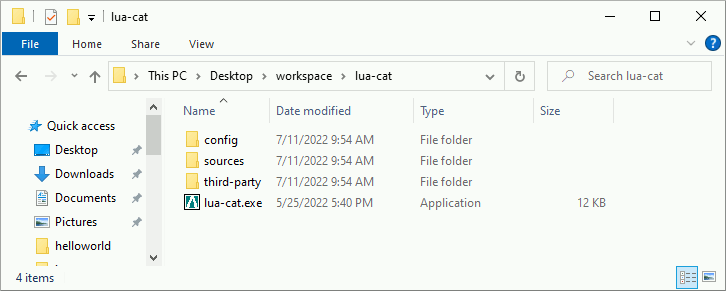
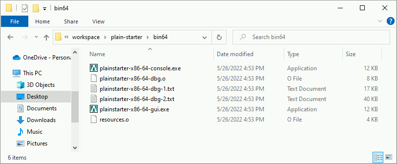

# What is plainstarter?

A lot of programs are written using some kind of virtual machine or interpreter:
Java, Python, Perl, Lua and many others.

- Java needs `javaw.exe`
- Python needs `pythonw.exe`
- Perl needs `perl.exe`
- Lua needs `luaXX.exe`
- Tcl/Tk needs `wish86t.exe`

This make it non-trivial to distribute such programs. For that reason, many of
these programs simply includes a script file usually named "start.bat" or
"program.bat" which call the underlying executable with the proper
parameters. Plainstarter is a generic project aiming to replace these
"start.bat" scripts with a proper executable file, containing the project's icon
and project's meta-data.

Note that the project's icon and the project's meta-data need to be updated by
the project's developers, it's obviously outside the scope of plainstarter.


# Small example

Let's see an example of plainstarter usage, more examples are available in [the
release area](https://github.com/pascalcombier/plain-starter/releases) (Lua,
Tcl/Tk, Common Lisp, etc). Let's implement the [UNIX
cat](https://en.wikipedia.org/wiki/Cat_(Unix)) command using
[Lua](https://www.lua.org/manual/5.4/manual.html) on Windows.

## Unix cat implementation

A trivial [UNIX cat](https://en.wikipedia.org/wiki/Cat_(Unix)) implementation
will take a list of filenames in the parameters and print the files content on
the standard output.

```lua
local Filenames = arg

for Index = 1, #Filenames do
  for Line in io.lines(Filenames[Index]) do
    io.write(Line)
    io.write("\n")
  end
end
```

## Files organization

There are 2 binary files in the `bin64` directory of plainstarter:

```
plainstarter-x86-64-console.exe
plainstarter-x86-64-gui.exe
```

The program [UNIX cat](https://en.wikipedia.org/wiki/Cat_(Unix)) is a command
line program, so we simply copy `plainstarter-x86-64-console.exe` and rename it
into `lua-cat.exe`. When `lua-cat.exe` will start, it will look for the
configuration file `configs/lua-cat.cfg`, then `config/lua-cat.cfg`, and finally
`lua-cat.cfg`. The first configuration file found will be used, the others will
be ignored.

To run Lua scripts, we need to get the [Lua binaries
files](http://luabinaries.sourceforge.net/download.html). To make it clear that
these binary files are outside the scope of lua-cat project, we copy them in the
directory `third-party`.

```
lua-cat
├───lua-cat.exe (duplicate of plainstarter-x86-64-console.exe)
│
├───config
│    └─── lua-cat.cfg
│
├───sources
│    └─── cat.lua
│
└───third-party
    └───bin
         ├───lua54.dll
         ├───lua54.exe
         ├───luac54.exe
         └───wlua54.exe
```

## Configuration

The configuration file need to override the `%PATH%` variable, to make Lua
binaries available to `lua-cat.exe`. To make it more portable, `third-party\bin`
is prefixed to `%PATH%` instead of postfixed.

`lua-cat.cfg`

```
PLAINSTARTER_OPTIONS=monitor-process show-console
PATH=%PLAINSTARTER_DIRECTORY%\third-party\bin;%PATH%
PLAINSTARTER_CMD_LINE=lua54 %PLAINSTARTER_DIRECTORY%\sources\cat.lua
```

`PLAINSTARTER_CMD_LINE` defines the command line to execute. Note that all the
parameters provided to plainstarter will be appended to `PLAINSTARTER_CMD_LINE`
implicitly. If `lua-cat.exe PARAM1 PARAM2 PARAM3` is executed, the command line
`lua54 %PLAINSTARTER_DIRECTORY%\sources\cat.lua PARAM1 PARAM2 PARAM3` will be
executed.

Note that to get a really portable program, it is important to prefix the Lua
script with %PLAINSTARTER_DIRECTORY%. Doing that allow the script to work
properly regardless the value of the working directory (aka %CD%, $pwd). To give
a specific example, calling something like "..\lua-cat.exe test\test.txt" will
work if the files and directories matches.




# Changing the icon

If one need to modify the icon, he can change the file `art/plainstarter.ico`
from plainstarter project and recompile the source code. He can also use the
cost-free software [Resource Hacker](http://www.angusj.com/resourcehacker/) to
edit the binary without recompilation.

# Changing the meta-data

One need to modify the resource file `src/resources.rc` from plainstarter
project. Then a new plainstarter compilation is needed.


# Compiling plainstarter

With the help of
[plain-toolchain-x86-64](https://github.com/pascalcombier/plain-toolchain-x86-64),
plainstarter's compilation should be straight-forward:




# Troubleshooting

* There is a behavior in plainstarter which is not properly documented regarding
  parameter management and may lead to  confusion. On Windows, one may find some
  inconsistent behavior regarding the first parameter (argv[0]) depending on the
  way the process is created: by double-clicking on the executable using Windows
  Explorer or by calling the program  using the terminal emulator. When the user
  is  double-clicking on  an executable  file from  Windows Explorer,  the first
  parameter  given  to  the  program  is   the  full  path  of  executable  file
  (i.e.  C:\plain-starter\plain-starter.exe). When  the user  uses the  terminal
  emulator,  the   first  parameter   given  to  the   program  is   a  relative
  pathname.  This makes  things a  little bit  cumbersome to  handle, especially
  because most of the time, the program should have the same behavior regardless
  the way  it has been  started. For that  reason, plainstarter will  hide these
  inconstancies and will  _always_ provide the underlying process  the full path
  of the executable file.

* If  plainstarter is not working  properly, it's likely that  the configuration
  file is not using the proper  encoding. Plainstarter is an Unicode program, it
  supports non-ascii  characters in  the filenames  and configuration  files. To
  keep the software simple and  avoid run-time strings conversions, Plainstarter
  request to have UTF-16 LE encoded files containing an Unicode Byte Order Mark.

This can be achieved by using Windows's Notepad to save the file:


For other problems, the errors have a specific identifier so that it can be easy
to find the location in the source code.


# Technical reference

A [technical reference](REFERENCE.adoc) is available in a dedicated page.
