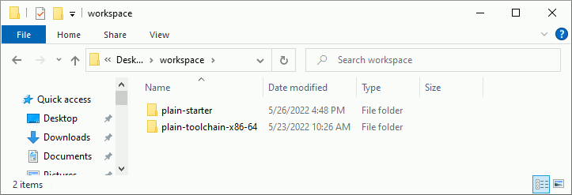
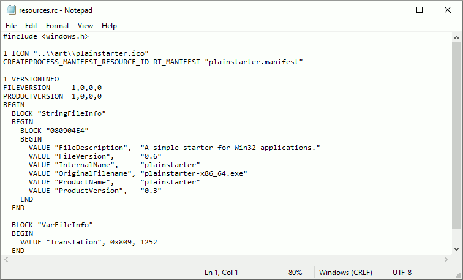
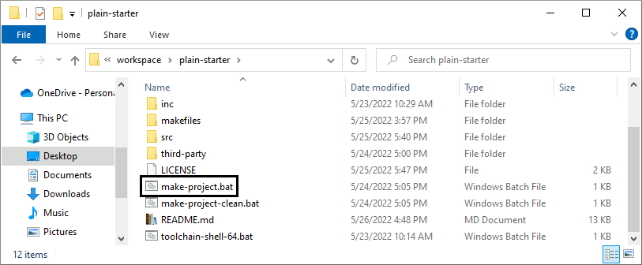
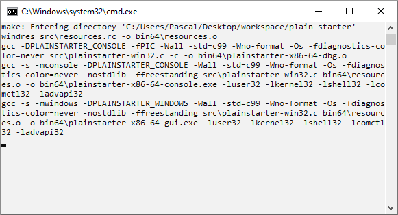

= Plainstarter Reference
:toc:
:toclevels: 4

:url-toolchain:        https://github.com/pascalcombier/plain-toolchain-x86-64
:url-releases:         https://github.com/pascalcombier/plain-starter/releases
:url-cat:              https://en.wikipedia.org/wiki/Cat_(Unix)
:url-lua:              https://www.lua.org/manual/5.4/manual.html
:url-lua-bin:          http://luabinaries.sourceforge.net/download.html
:url-msdn:             https://msdn.microsoft.com/en-us/library/windows/desktop/aa365247(v=vs.85).aspx
:url-vbs:              http://stackoverflow.com/questions/22476706/launch-bat-files-from-a-custom-url-handler-without-showing-the-console-window
:url-eclipse-launcher: http://help.eclipse.org/luna/index.jsp?topic=%2Forg.eclipse.platform.doc.isv%2Freference%2Fmisc%2Flauncher.html
:url-license:          https://opensource.org/licenses/BSD-2-Clause
:url-bbox:             https://github.com/rmyorston/busybox-w32
:url-rh:               http://www.angusj.com/resourcehacker/

== Document versioning

[cols="1,2,2,5",options="header"]
|========================================================
| Version | Date       | Author         | Comment
| v0.1    | 2017-05-06 | Pascal COMBIER | Initial release
| v0.2    | 2022-07-17 | Pascal COMBIER | Optimizations
|========================================================

== Introduction

Plainstarter is a lightweight starter for Microsoft Windows programs. The
purpose is to help software developers _to expose a simple executable file to
end-user_, hiding the fact that the application is implemented using
third-party's interpreters such as Python or Java. It can be used in place of
batch scripts, allowing developers to focus on the implementation of their
software instead of learning batch commands. Plainstarter is a native Windows
program which is directly exposed to the end-user. When executed, it reads a
configuration file and start the real program as configured by the
developer. The executable filename and icon are expected to be changed by the
developer to match the application purpose.

.Objectives of Plainstarter
* Start programs in an accurate and consistent way
** Simple behavior regarding spaces, quotes, parameters, long-filenames and Unicode
** Configure environment variables (e.g. PATH, APPDATA) and export them to underlying process
** Hide terminal console for GUI programs implemented using third-party interpreters (e.g. Python, Java, Lua, Tcl/Tk, Common Lisp)
** Easy access to directory name and program name
* Small binary size
* Permissive license allowing cost-free commercial use footnote:[Simplified BSD License: {url-license}]

== Simple example

Let's see an example of plainstarter usage, more examples are available in
{url-releases}[the release area] (Lua, Tcl/Tk, Common Lisp, etc). Let's
implement the UNIX cat command using {url-lua}[Lua] on Windows.

=== Unix cat implementation

A trivial {url-cat}[UNIX cat] implementation will take a list of filenames in
the parameters and print the files content on the standard output.

.lua-cat.lua
[source,lua]
----
local Filenames = arg

for Index = 1, #Filenames do
  for Line in io.lines(Filenames[Index]) do
    io.write(Line)
    io.write("\n")
  end
end
----

=== Files organization

There are 2 binary files in the `bin64` directory of plainstarter:

```
plainstarter-x86-64-console.exe
plainstarter-x86-64-gui.exe
```

The program {url-cat}[UNIX cat] is a command-line program, so we simply copy
`plainstarter-x86-64-console.exe` and rename it into `lua-cat.exe`. When
`lua-cat.exe` will start, it will look for the configuration file
`configs/lua-cat.cfg`, then `config/lua-cat.cfg`, and finally `lua-cat.cfg`. The
first configuration file found will be used, the others will be ignored.

To run Lua scripts, we need to get the {url-lua-bin}[Lua binaries files]. To
make it clear that these binary files are outside the scope of lua-cat project,
we copy them in the directory `third-party`.

```
lua-cat
├───lua-cat.exe (duplicate of plainstarter-x86-64-console.exe)
│
├───config
│   └─── lua-cat.cfg
│
├───sources
│   └─── cat.lua
│
└───third-party
    └───bin
        ├─── lua54.dll
        ├─── lua54.exe
        ├─── luac54.exe
        └─── wlua54.exe
```

=== Configuration

The configuration file need to override the `%PATH%` variable to make Lua
binaries available to `lua-cat.exe`. To make it more portable, `third-party\bin`
is prefixed to `%PATH%` instead of postfixed.

.lua-cat.cfg
```
PLAINSTARTER_OPTIONS=monitor-process show-console
PATH=%PLAINSTARTER_DIRECTORY%\third-party\bin;%PATH%
PLAINSTARTER_CMD_LINE=lua54 sources\cat.lua
```

`PLAINSTARTER_CMD_LINE` defines the command line to execute. Note that all the
parameters provided to plainstarter will be appended to `PLAINSTARTER_CMD_LINE`
implicitly. If `lua-cat.exe PARAM1 PARAM2 PARAM3` is executed, the command line
`lua54 sources\cat.lua PARAM1 PARAM2 PARAM3` will be executed.

image::docs/images/lua-cat-plainstarter-1.png[screenshot]
image::docs/images/lua-cat-plainstarter-2.png[screenshot]

== Technical reference

=== Plainstarter initialization process

In this chapter, we will consider that the Plainstarter binary file has been
renamed to "cmd-example.exe" and stored in the directory "example".

.When `example\cmd-example.exe` is started, the following steps are executed:
. Find a configuration file
.. Try to open `example\configs\cmd-example.cfg`
.. Try to open `example\config\cmd-example.cfg`
.. Try to open `example\cmd-example.cfg`
. Read the configuration file, line per line
.. If the line start with `#`, the line is considered as a comment and is ignored
.. If the line is a variable affectation such as `PATH=%PATH%;subdir`, the variable is registered in the local environment
.. If the line is a command line such as `PLAINSTARTER_CMD_LINE=cmd.exe`, the command
line is executed with the current environment

NOTE: Only the first configuration file which is found is considered. The other
configuration files are ignored.

=== Special environment variables

These variables can be used in Plainstarter configuration file. They will not be
exported to the child processes. If needed, it's straight-forward to export these special variables:

.cmd-example.cfg
[source]
----
MYAPP_DIR=%PLAINSTARTER_DIRECTORY%
MYAPP_PROGNAME=%PLAINSTARTER_PROGNAME%
MYAPP_OPTIONS=%PLAINSTARTER_OPTIONS%
PLAINSTARTER_CMD_LINE=cmd.exe /K echo "%PLAINSTARTER_DIRECTORY%" "%PLAINSTARTER_PROGNAME%"
----

==== PLAINSTARTER_CMD_LINE

This is the command line to execute. All the parameters given to Plainstarter
will be appended to PLAINSTARTER_CMD_LINE. This behavior is required to transmit
command line options to the underlying programs.

==== PLAINSTARTER_DIRECTORY

This is the absolute directory where is located the Plainstarter executable.

==== PLAINSTARTER_PROGNAME

This is the name of the executable without the filename extension ".exe". This
can be used when the behavior of the underlying program depends on the name of
the executable (e.g. {url-bbox}[busybox-w32]).

==== PLAINSTARTER_OPTIONS

Plainstarter can be dynamically configured using the special variable named
PLAINSTARTER_OPTIONS. This variable should contain a list of keywords separated
by spaces. Keywords are case-sensitive and described below.

===== show-console
* Show the terminal console cmd.exe
* Default: disabled

* This option should be used when the end-user program is requesting the
standard input. A typical example is a Lua or Common Lisp REPL, which is waiting
for the user to input commands from a terminal. Programs exposing Graphical User
Interface should probably not activate this option. When activated, this option
also activates the option _monitor-process_.

===== init-common-controls
* Try to enable Windows Visual Styles
* Default: disabled

* This option is used for Graphical User Interface programs which are using
Microsoft Windows native widgets. When using this option, the native widgets
will be drawn using new graphical styles. This is implemented by calling the
Win32 function InitCommonControls.

===== monitor-process
* Monitor the child process return code
* Default: disabled

* By default, Plainstarter simply spawns new processes according to
PLAINSTARTER_CMD_LINE. The child process is started and Plainstarter process is
closed, returning 0 as process return code. When activated, this option makes
Plainstarter wait for the end of execution of the child process. If the child
process ends abnormally, the process error code will be notified to the
user. The error code of the child process will be returned by Plainstarter
process.

image::docs/images/reference/option-monitor-process.png[screenshot]

===== debug
* Display expanded PLAINSTARTER_CMD_LINE variable
* Default: disabled

* This option is used for debug purposes. It will display the expanded
PLAINSTARTER_CMD_LINE variable right before execution.


== Limitations

=== UTF-16

Plainstarter is a Unicode program, it supports non-ascii characters in the
filenames and configuration files. To keep the software simple and avoid
run-time strings conversions, Plainstarter request to have UTF-16 LE encoded
files containing a Unicode Byte Order Mark.

This can be achieved by using notepad.exe to save the file:

image::docs/images/reference/notepad-unicode-2.png[screenshot]

=== Software limits

Plainstarter currently have the following hard-coded limitations. These
limitations can only be changed by modifying the source code.

- The maximum size for a configuration file is 10kB
- A line of a configuration file cannot be larger than 1024 bytes

== Configuration

=== Source code configuration

==== Configure directories

----
static const TCHAR PS_CONFIG_DIR_1[8]  = _T("configs\\");
static const TCHAR PS_CONFIG_DIR_2[7]  = _T("config\\");
static const TCHAR PS_CONFIG_DIR_3[1]  = _T("");
----

==== Size limit for a filename

NTFS long-filenames are supported by default, allowing filenames up to 32767
characters. More information is available on {url-msdn}[the MSDN].

----
static const size_t PS_MAX_FILENAME_LENGTH_CHAR = (size_t)32767;
----

==== Size limit of configuration file

----
static const size_t PS_MAX_CONFIG_FILE_SIZE = (size_t)10240;
----

==== Size limit of line

----
#define PS_MAX_LINE_LEN_BYTES ((unsigned int)1024)
----

=== Change icon with software compilation

The icon is located in `art\plainstarter.ico`. The source code needs to be recompiled.

=== Change icon without software compilation

It is possible to change the icon present in the Plainstarter executable file
without recompiling the program. The cost-free proprietary program
{url-rh}[Resource Hacker] v4.5.30 has been reported working with Plainstarter
executable files.

image::docs/images/reference/resource-hacker.png[screenshot]

== Compilation

With the help of {url-toolchain}[plain-toolchain-x86-64], plainstarter's
compilation should be straight-forward:


image::docs/images/plainstarter-02-directory.png[screenshot]



image::docs/images/plainstarter-06-compilation-output.png[screenshot]

== Troubleshooting

Each error is reference with a unique number so that it's easy to find the root
cause in the software source code.


== Alternatives

=== Batch files

Batches files are often used to start programs based on third-party interpreters
such as Python.

=== Visual Basic Script

As referenced on {url-vbs}[StackOverflow], Visual Basic Scripts can be used to
start other programs.

=== Eclipse Launcher

Eclipse is a development environment for Java programming language. This IDE is
shipped with their own launcher named Eclipse Launcher (eclipse.exe).

----
Eclipse contains a native executable launcher that is used to start Eclipse.
There is more to the launcher than just the eclipse executable in the root of
the install.  The launcher and its shared library

The launcher executable comes in 2 pieces: the executable (eclipse.exe), and a
shared library (eclipse_1017.dll). The executable lives in the root of the
eclipse install. The shared library is in a platform specific fragment,
org.eclipse.equinox.launcher.[config], in the plugins directory.

Having the majority of the launcher code in a shared library that lives in a
fragment means that that portion of the launch code can now be updated from an
update site. Also, when starting from java, the shared library can be loaded via
JNI in order to display the splash screen.
----
Eclipse Project Documentation ({url-eclipse-launcher}[source])

== License

Plainstarter is licensed using the permissive Open Source license known as
{url-license}[Simplified BSD License].

----
Copyright 2014-2022 Pascal COMBIER

Redistribution and use in source and binary forms, with or without modification,
are permitted provided that the following conditions are met:

1. Redistributions of source code must retain the above copyright notice, this
list of conditions and the following disclaimer.

2. Redistributions in binary form must reproduce the above copyright notice,
this list of conditions and the following disclaimer in the documentation and/or
other materials provided with the distribution.

THIS SOFTWARE IS PROVIDED BY THE COPYRIGHT HOLDERS AND CONTRIBUTORS "AS IS" AND
ANY EXPRESS OR IMPLIED WARRANTIES, INCLUDING, BUT NOT LIMITED TO, THE IMPLIED
WARRANTIES OF MERCHANTABILITY AND FITNESS FOR A PARTICULAR PURPOSE ARE
DISCLAIMED. IN NO EVENT SHALL THE COPYRIGHT HOLDER OR CONTRIBUTORS BE LIABLE FOR
ANY DIRECT, INDIRECT, INCIDENTAL, SPECIAL, EXEMPLARY, OR CONSEQUENTIAL DAMAGES
(INCLUDING, BUT NOT LIMITED TO, PROCUREMENT OF SUBSTITUTE GOODS OR SERVICES;
LOSS OF USE, DATA, OR PROFITS; OR BUSINESS INTERRUPTION) HOWEVER CAUSED AND ON
ANY THEORY OF LIABILITY, WHETHER IN CONTRACT, STRICT LIABILITY, OR TORT
(INCLUDING NEGLIGENCE OR OTHERWISE) ARISING IN ANY WAY OUT OF THE USE OF THIS
SOFTWARE, EVEN IF ADVISED OF THE POSSIBILITY OF SUCH DAMAGE.
