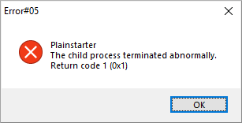
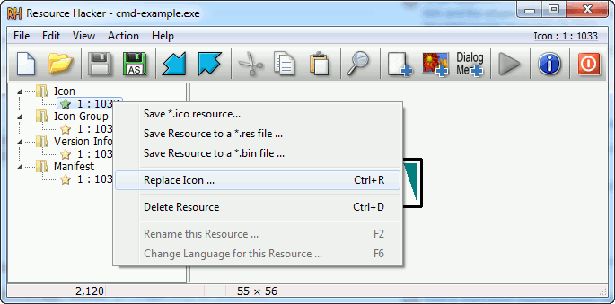

# Introduction

Plainstarter is a lightweight starter for Microsoft Windows programs.  The
purpose is to help software developers *to expose a simple executable file to
end-user*, hidding the fact that the application is implemented using
third-party interpreters such as Python or Java.  It can be used in place of
batch scripts, allowing developers to focus on the implementation of their
software instead of learning batch commands. Plainstarter is a native Windows
program which is directly exposed to the end-user. When executed, it will read a
configuration file and start the real program as configured by the
developer. The executable filename and icon are expected to be changed by the
developper to match the application purpose.

Objectives of Plainstarter
- Start programs in an accurate and consistent way
    - Simple behavior regarding spaces, quotes, parameters, long-filenames and Unicode
    - Configure environment variables (e.g. PATH, APPDATA)
    - Hide terminal console for GUI implemented using third-party interpreters (e.g. Java, Common Lisp)
    - Easy access to directory name and program name
- Small binary size
- Permissive license allowing cost-free commercial use [^1]

## Simple example

This application example will open a new `cmd.exe` terminal window. In this
example, the Plainstarter executable file has been renamed to `cmd-example.exe`
and the configuration file has been named `cmd-example.cfg`. This example could
be reused to implement command lines programs without exposing the flags
specific to the underlying interpreter.

## Configuration file `cmd-example.cfg`

```
PATH=%PLAINSTARTER_DIRECTORY%\bin;%PATH%
PLAINSTARTER_OPTIONS=show-console debug
PLAINSTARTER_CMD_LINE=cmd.exe /K echo "%PLAINSTARTER_DIRECTORY%" "%PLAINSTARTER_PROGNAME%"
```

Comments:
- Prepend the subdirectory `bin\` which may contain application-specific DLLs to the PATH
- The option show-console is used to show the terminal console of the child process cmd.exe
- The option debug is used to explain the behavior of Plainstarter
- The command line create a new terminal and print the content of special the
variables PLAINSTARTER_DIRECTORY and PLAINSTARTER_PROGNAME on the standard
output

## Understand Plainstarter

During the execution, all the parameters given to `cmd-example.exe` are
implicitly appended to `PLAINSTARTER_CMD_LINE`. In order to expose this
behavior, one could try to manually start Plainstarter from the Windows shell.


The debug option shows the expanded command line right before its execution. One
could copy the text of the dialog box with the `Ctrl+C` shortcut.


The result is a new terminal window with the following information:
- The value of PLAINSTARTER_DIRECTORY
- The value of PLAINSTARTER_PROGNAME
- The first parameter given to cmd-example.exe
- The second parameter given to cmd-example.exe

Then the window below appears:


## Distribute your application

Remove the debug option and copy the executable and the configuration file into
your application directory.

	cmd-example.cfg

```
PATH=%PLAINSTARTER_DIRECTORY%\bin;%PATH%
PLAINSTARTER_OPTIONS=show-console
PLAINSTARTER_CMD_LINE=cmd.exe /K echo "%PLAINSTARTER_DIRECTORY%" "%PLAINSTARTER_PROGNAME%"
```


When the user double-click on `cmd-example.exe`, a new shell will be open.


# Technical reference

## Plainstarter initialization process

In this chapter, we will consider the previous example: the Plainstarter binary
file has been renamed to "cmd-example.exe" and stored in the directory
"example".

When `example\cmd-example.exe` is started, the following steps are processed:
- Find a configuration file
    - Try to open `example\configs\cmd-example.cfg`
    - Try to open `example\config\cmd-example.cfg`
    - Try to open `example\cmd-example.cfg`
- Read the configuration file, line per line
    - If the line start with `#`, the line is considered as a comment and is ignored
    - If the line is a variable affectation `PATH=%PATH%;subdir`, the variable is registred locally
    - If the line is a command line such as `PLAINSTARTER_CMD_LINE=cmd.exe`, the command
line is executed with the current environment.

Note that only the first configuration file which is found is considered. The
other configuration files will be ignored.

## Special environment variables

These variables can be used in Plainstarter configuration file. They will not be
exported to the child processes. If needed, it's straight-forward to export
these variables:

```
MYAPP_DIR=%PLAINSTARTER_DIRECTORY%
MYAPP_PROGNAME=%PLAINSTARTER_PROGNAME%
MYAPP_OPTIONS=%PLAINSTARTER_OPTIONS%
PLAINSTARTER_CMD_LINE=cmd.exe /K echo "%PLAINSTARTER_DIRECTORY%" "%PLAINSTARTER_PROGNAME%"
```

### PLAINSTARTER_CMD_LINE

This is the command line to execute. All the parameters given to Plainstarter
will be appended to `PLAINSTARTER_CMD_LINE`. This behavior is required to
transmit command line options to the underlying programs.

### PLAINSTARTER_DIRECTORY

This is the absolute directory where is located the Plainstarter executable.

### PLAINSTARTER_PROGNAME

This is the name of the executable without the filename extension ".exe". This
can be used when the behavior of the underlying program depends on the name of
the executable [^3].

### PLAINSTARTER_OPTIONS

Plainstarter can be dynamically configured using the special variable named
PLAINSTARTER_OPTIONS. This variable should contain a list of keywords separated
by spaces. Keywords are case-sensitive and described below.

#### show-console
* Show the terminal console cmd.exe
* Default: disabled
* This option should be used when the end-user program is requesting the
standard input. A typical example is a Common Lisp REPL, which is waiting for
the user to input commands trough a terminal. Programs exposing Graphical User
Interface should probably not activate this option.

#### init-common-controls
* Try to enable Windows Visual Styles
* Default: disabled
* This option is used for Graphical User Interface which are using Microsoft
Windows native widgets. When using this option, the native widgets will be
drawed using new graphical styles. This is implemented by calling the Win32
function InitCommonControls.

#### monitor-process
* Monitor the child process return code
* Default: disabled
* By default, Plainstarter simply spawns new processes according to
PLAINSTARTER_CMD_LINE. The child process is started and Plainstarter process is
closed, returning 0 as process return code. When activated, this option makes
Plainstarter wait for the end of execution of the child process. If the child
process ends abnormally, the processs error code will be notified to the
user. The error code of the child process will be returned by Plainstarter
process.



#### debug
* Display expanded PLAINSTARTER_CMD_LINE variable
* Default: disabled
* This option is used for debug purposes. It will display the expanded
PLAINSTARTER_CMD_LINE variable before execution.


## Limitations

### UTF-16

Plainstarter is an Unicode program, it supports non-ascii characters in the
filenames and configuration files. To keep the software simple and avoid
run-time strings conversions, Plainstarter request to have UTF-16 LE encoded
files containing an Unicode Byte Order Mark.

This can be achieved by using notepad.exe to save the file:


### Software limits

Plainstarter currently have the following hard-coded limitations. This
limitations can only be changed by modifying the source code.

- The maximum size for a configuration file is 10kB
- A line of a configuration file cannot be larger than 1024 bytes

### Source code configuration

#### Configure directories

```
static const TCHAR PS_CONFIG_DIR_1[8] = _T("configs\\");
static const TCHAR PS_CONFIG_DIR_2[7] = _T("config\\");
static const TCHAR PS_CONFIG_DIR_3[1] = _T("");
```

#### Size limit for a filename

NTFS long-filenames are supported by default, allowing filenames up to 32767
characters. More information is available on the Microsoft MSDN[^4].

```
static const size_t PS_MAX_FILENAME_LENGTH_CHAR = (size_t)32767;
```

#### Size limit of configuration file

```
static const size_t PS_MAX_CONFIG_FILE_SIZE = (size_t)10240;
```

#### Size limit of line

```
#define PS_MAX_LINE_LEN_BYTES ((unsigned int)1024)
```

### Change icon with software compilation

The icon is located in `art\plainstarter.ico`.

### Change icon without software compilation

It is possible to change the icon present in the Plainstarter executable file
without recompiling the program. The cost-free proprietary program Resource
Hacker[^2] has been reported working with Plainstarter executable files.



[^1]: [Simplified BSD License](https://opensource.org/licenses/BSD-2-Clause)
[^2]: [Resource Hacker](http://www.angusj.com/resourcehacker)
[^3]: [BusyBox](https://www.busybox.net/about.html) and [BusyBox-w32](https://frippery.org/busybox/)
[^4]: [Windows API PATH](https://docs.microsoft.com/en-us/windows/win32/fileio/maximum-file-path-limitation?tabs=cmd)
